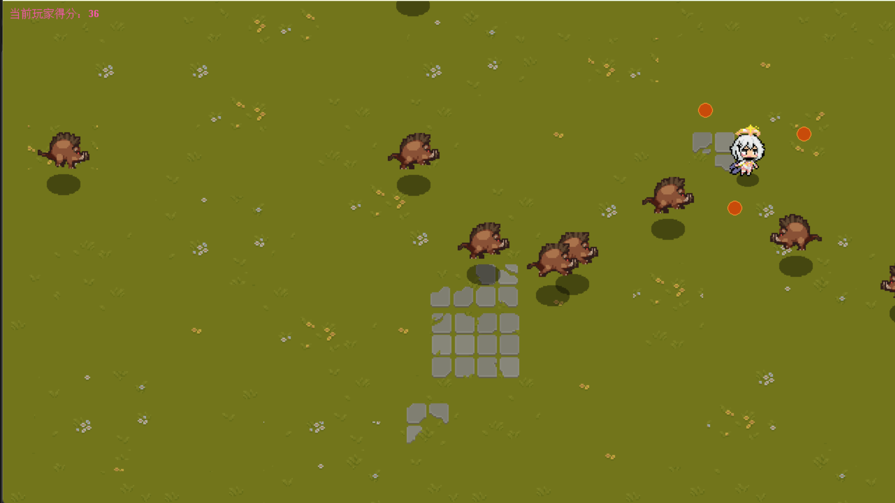
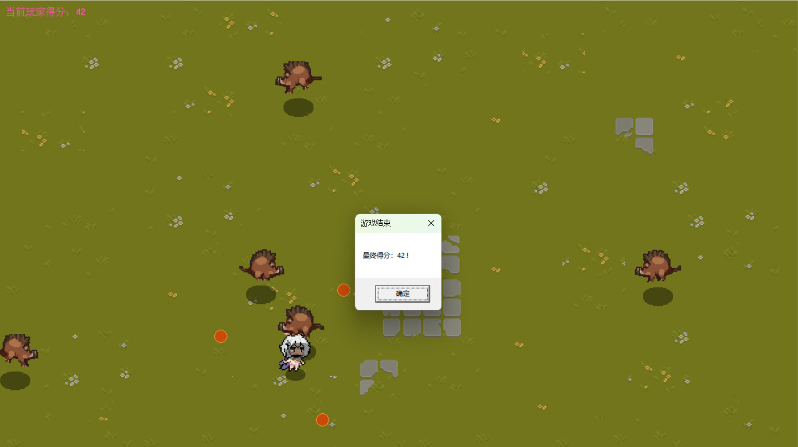

# 提瓦特幸存者 (Teyvat Survivor)

一款基于 C++ 与 EasyX 图形库 开发的 2D 幸存者类小游戏。

玩家控制角色在提瓦特大陆上移动，周围环绕着旋转的元素弹幕；敌人会从屏幕四周不断刷新并朝玩家扑来。利用弹幕击杀敌人可获得分数，一旦被敌人碰到，游戏结束。看看你能坚持多久、拿到多少分！

> 仅供学习交流使用的同人作品，与《原神》官方无关。

## 截图

### 主菜单

<!--  -->

### 游戏画面

<!--  -->

### 游戏结束

<!--  -->

## 游戏玩法

- 移动：方向键（↑ ↓ ← →）控制角色上下左右移动，支持斜向移动
- 攻击：弹幕自动环绕角色旋转，碰到敌人即可将其击杀
- 计分：每击杀一个敌人得 1 分
- 失败条件：被敌人碰到即游戏结束，弹窗显示最终分数
- 敌人会从屏幕四周随机边界不断刷新，并始终朝玩家追踪移动

## 功能特性

- 1280 × 720 窗口，144 FPS 帧率限制，双缓冲渲染防止画面闪烁
- 基于帧图集（Atlas）与计时器的角色/敌人行走动画
- AlphaBlend 半透明图像绘制
- 三态按钮（常态 / 悬停 / 按下）实现的主菜单 UI
- 敌人随机边界刷新 + 追踪 AI
- 矩形碰撞检测（子弹-敌人、敌人-玩家）
- 背景音乐（BGM）与击中音效（MCI 多媒体接口）
- 实时分数显示

## 环境要求

| 依赖 | 说明 |
| ---- | ---- |
| Visual Studio 2022 | 项目使用 v143 工具集 |
| C++ | 标准 C++（需支持 C++11 及以上） |
| EasyX | C++ 图形库，需安装 EasyX 后才能编译 |

## 如何运行

1. 克隆本仓库：

        git clone https://github.com/Dilyar0920/Teyvat-Survivors.git

2. 安装 EasyX（easyx.cn/downloads），安装时选择对应的 Visual Studio 2022 版本
3. 用 Visual Studio 2022 打开 提瓦特幸存者.sln
4. 选择 x64 平台，直接按 Ctrl + F5 编译运行

注意：游戏的图片资源位于 img/ 目录、音频位于 mus/ 目录，exe 需要在这些资源所在目录下运行。用 VS 直接启动时会自动将工作目录设为项目目录，因此无需额外配置。

## 项目结构

    提瓦特幸存者/
    ├── 提瓦特幸存者.sln          # VS 解决方案
    └── 提瓦特幸存者/
        ├── 源.cpp                # 全部游戏代码
        ├── 提瓦特幸存者.vcxproj  # VS 项目文件
        ├── img/                  # 图片资源
        │   ├── background.png    # 战斗背景
        │   ├── menu.png          # 主菜单背景
        │   ├── player_left/right_*.png   # 玩家行走帧（6 帧）
        │   ├── enemy_left/right_*.png    # 敌人行走帧（6 帧）
        │   └── ui_start/quit_*.png       # 按钮（常态/悬停/按下）
        └── mus/                  # 音频资源
            ├── bgm.mp3           # 背景音乐
            └── hit.wav           # 击中音效

## 代码结构简介

全部逻辑位于 源.cpp，主要类：

| 类 | 职责 |
| ---- | ---- |
| Atlas | 帧图集：批量加载序列帧图片 |
| Animation | 动画：按间隔循环播放帧图集 |
| Player | 玩家：键盘输入、归一化移动、朝向动画 |
| Enemy | 敌人：随机边界刷新、追踪移动、碰撞检测 |
| Bullet | 子弹：围绕玩家做波浪形旋转运动 |
| Button | 按钮基类：三态 UI，StartGameButton / QuitGameButton 继承实现点击行为 |

主循环流程：处理消息 → 更新（生成敌人 / 移动 / 碰撞 / 清理）→ 绘制 → 帧率控制。

## 说明

- 本项目为 C++ / EasyX 的学习实践作品
- 游戏中的美术素材与音乐仅用于学习交流，版权归各自所有者所有
